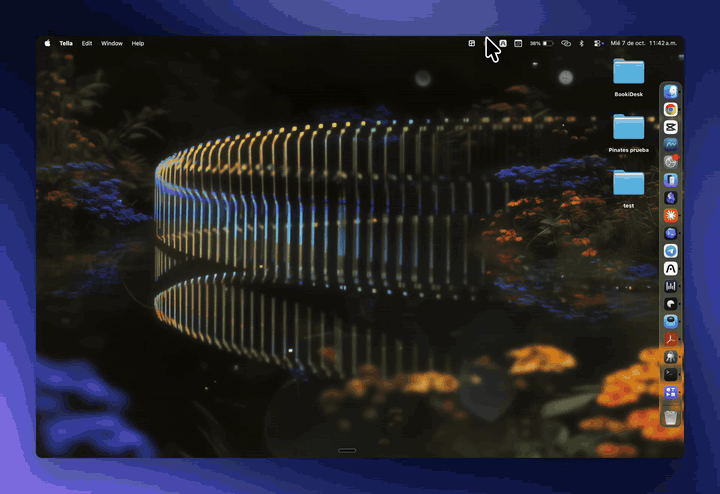

<p align="center">
  
</p>

<h1 align="center">VenaScreen</h1>

<p align="center">
  Capturas de pantalla colgadas en una línea, justo encima de tu pantalla.<br>
  Capturas, copias, editas y guardas sin llenar el Escritorio.
</p>

<p align="center">
  macOS 14 o superior · Swift, AppKit y SwiftUI · Sin red · Gratis y de código abierto
</p>

<p align="center">
  
</p>

---

## Qué hace

- **Capturas con un atajo.** ⌥1 captura un área y la cuelga en la línea al instante. No pasa por el Escritorio ni por ninguna carpeta.
- **Todo a mano.** Acerca el puntero a la barra de menú y la línea baja. Aléjalo y se esconde.
- **Editor propio.** Doble click en una captura para marcarla con flechas, cajas, texto, resaltador, pixelado y pasos numerados.
- **Texto de cualquier imagen.** ⌃⌥⌘O selecciona un área y copia su texto, con reconocimiento en el propio Mac.
- **Solo guardas lo que quieres.** Arrastra una captura a una app o carpeta, o guárdala en Descargas/Capturas. Lo demás se descuelga.

## Atajos

| Atajo | Qué hace |
|:--|:--|
| ⌥ 1 | Captura un área. Espacio elige una ventana y Esc cancela |
| ⌘ ⇧ 1 | Captura la pantalla donde está el puntero |
| ⌃ ⌥ ⌘ O | Copia el texto de un área, sin colgar nada |
| ⌃ ⌥ T | Muestra u oculta la línea |

## En la línea

| Gesto | Qué hace |
|:--|:--|
| Click | Copia la imagen |
| Doble click o mantener presionado | Abre el editor |
| Click derecho | Copiar texto, Guardar en Capturas, Guardar como… y más |
| Arrastrar a una app | Envía una copia y la captura sigue colgada |
| Arrastrar a una carpeta | La guarda ahí y sale de la línea |
| Cruz de la esquina o arrastrar a la Papelera | La descuelga |

## Editor

| Tecla | Herramienta |
|:--|:--|
| V | Seleccionar y mover. Suprimir borra |
| A | Flecha. ⇧ la fija cada 45° |
| R | Rectángulo. ⇧ lo hace cuadrado |
| O | Óvalo |
| T | Texto. Doble click en un texto para editarlo |
| H | Resaltador |
| B | Pixelar, para tapar datos |
| N | Pasos numerados |
| C | Recortar. Enter aplica y Esc cancela |
| 1 a 8 | Colores |

⌘Z deshace y ⌘⇧Z rehace. ⌘C copia y **Esc copia y cierra**. ⌘S guarda en Descargas/Capturas y ⌘⇧S deja elegir dónde.

## Carpetas vigiladas

En el menú de la barra, **Vigilar también** cuelga cualquier imagen nueva que llegue a las carpetas que elijas, como Descargas. Sirve para imágenes de otras apps, del navegador o de AirDrop.

## Compilar

```sh
git clone https://github.com/venadigital/venascreen.git
cd venascreen
scripts/build-app.sh
open build/VenaScreen.app
```

Requiere las Command Line Tools de Xcode. Xcode completo es opcional.

La primera captura pide el permiso de **Grabación de pantalla**. Después de activarlo, VenaScreen ofrece reabrirse para aplicarlo.

**Firma estable, opcional.** Si en tu llavero hay un certificado de firma de código llamado `VenaScreen Dev`, el script firma con él y macOS recuerda los permisos entre compilaciones. Puedes crearlo con Asistente para Certificados: tipo de identidad "Raíz autofirmada" y tipo de certificado "Firma de código". Sin él, la app se firma de forma provisional y macOS vuelve a pedir los permisos tras cada compilación.

## Privacidad

Sin cuentas, sin red y sin analíticas. Las capturas y el reconocimiento de texto nunca salen de tu Mac.

## Créditos

VenaScreen parte de [Tendedero](https://github.com/alejandrobujan/tendedero), de Alejandro Buján, publicado con licencia MIT. De Tendedero vienen la línea, sus animaciones y los gestos. VenaScreen agrega:

- la captura propia
- el editor
- el reconocimiento de texto
- las carpetas vigiladas
- guardar en Capturas

## Licencia

El código es MIT. Consulta [LICENSE](LICENSE). El nombre VenaScreen y el logo de Vena Digital no están cubiertos por la licencia. Las condiciones de los nombres e íconos están en [TRADEMARKS.md](TRADEMARKS.md).
